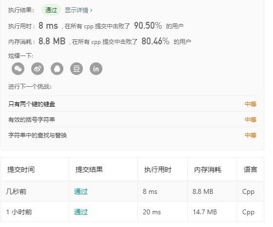

# 115. 不同的子序列

```c++
给定一个字符串 S 和一个字符串 T，计算在 S 的子序列中 T 出现的个数。

一个字符串的一个子序列是指，通过删除一些（也可以不删除）字符且不干扰剩余字符相对位置所组成的新字符串。（例如，"ACE" 是 "ABCDE" 的一个子序列，而 "AEC" 不是）

示例 1:

输入: S = "rabbbit", T = "rabbit"
输出: 3
解释:

如下图所示, 有 3 种可以从 S 中得到 "rabbit" 的方案。
(上箭头符号 ^ 表示选取的字母)

rabbbit
^^^^ ^^
rabbbit
^^ ^^^^
rabbbit
^^^ ^^^

来源：力扣（LeetCode）
链接：https://leetcode-cn.com/problems/distinct-subsequences
著作权归领扣网络所有。商业转载请联系官方授权，非商业转载请注明出处。
```

---

```c++
class Solution {
public:
	int numDistinct(string s, string t) {
		int sLen = s.size(); //长的
		int tLen = t.size(); //短的

		vector<vector<long>> dp(tLen+1, vector<long>(sLen+1, 0));
		dp[0] = vector<long>(sLen + 1, 1);

		for (int i = 0; i < tLen; i++) {
			for (int j = 0; j < sLen; j++) {
				dp[i + 1][j + 1] = dp[i + 1][j]; //默认 如果不匹配，当前的值就是横向的上一个值
				if (s[j] == t[i]) {
					//此时可以选择不pick或者pick，所以此次的值就是两项相加
					dp[i + 1][j + 1] += dp[i][j];
				}
			}
		}
		return dp[tLen][sLen];

	}
};
```

---

采用动态规划的方法，具体思路类似于这种：


这种方法空间复杂度为O(n*m)，显然记录了许多不必要的元素，为了节约空间，可以改为如下：

```c++
class Solution {
public:
    // 降低空间复杂度的动态规划
    int numDistinct(string s, string t){
        // 初始化第一行
        vector<long> dp(s.size()+1, 1);
        // 记录上一个保存的值
        int pre = 1;
        for(int i=1; i<=t.size(); ++i)
            for(int j=0; j<=s.size(); ++j){
                int tem = dp[j];
                if(j==0) dp[j] = 0;
                else {
                    // 是否相等都要加上前面的值
                    dp[j] = dp[j-1];
                    // 相等时加上，上一个字符匹配得出的结果
                    if(s[j-1] == t[i-1]) dp[j] += pre;
                }
                pre = tem;
            }
 
        return dp[s.size()];
    }
};
```

这种方法空间复杂度为O(n)，空间复杂度为O(n*m)，我们可以注意到，每次主字符串进一位，都需要重新遍历待匹配的字符串，而此时该字符串的所有信息我们都已经知道了，可以对字符串 t 构造字典，优化时间复杂度：

```c++
class Solution {
public:
    // 列主序，通过构造 t 的字典，进一步降低时间复杂度的动态规划
    // 倒序计算，不用保存pre
    int numDistinct(string s, string t){
        // 初始化第一行
        vector<long> dp(t.size()+1, 0);
        // 代表当字符串 s 匹配空字符串时的结果
        dp[0] = 1;
 
        // 构造 t 的字典，当字符串的字符重复时，通过 next 数组访问下一个
        vector<int> hash(128, -1);
        vector<int> next(t.size(), -1);  //默认为-1，表示此时已经不存在下一个要匹配字符
        for(int i=0; i<t.size(); ++i){
            int c = t[i];
            // next 存放字符 c 之前的位置，然后再更新 hash 的位置
            next[i] = hash[c];   //由于是倒序匹配，所以第一个一定是-1，，next存储的是该位置处下一个位置
            hash[c] = i;  //hash的值存储的是倒序匹配到的第一个字符位置
        }
 
        for(int i=0; i<s.size(); ++i)
            // 降低当前 for 的时间复杂度
            for(int j=hash[s[i]]; j>=0; j = next[j]) //倒序匹配，直接对匹配到的字符位置处改变值，如果为-1，表示没有下一个，直接跳出
                dp[j+1] += dp[j];
 
        return dp[t.size()];
    }
}
```

结果对比：


