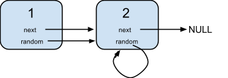

# 138. 复制带随机指针的链表

```c++
给定一个链表，每个节点包含一个额外增加的随机指针，该指针可以指向链表中的任何节点或空节点。

要求返回这个链表的深拷贝。 

 

示例：
```


```c++
输入：
{"$id":"1","next":{"$id":"2","next":null,"random":{"$ref":"2"},"val":2},"random":{"$ref":"2"},"val":1}

解释：
节点 1 的值是 1，它的下一个指针和随机指针都指向节点 2 。
节点 2 的值是 2，它的下一个指针指向 null，随机指针指向它自己。
 

提示：

你必须返回给定头的拷贝作为对克隆列表的引用。

来源：力扣（LeetCode）
链接：https://leetcode-cn.com/problems/copy-list-with-random-pointer
著作权归领扣网络所有。商业转载请联系官方授权，非商业转载请注明出处。
```

---

```c++
/*
// Definition for a Node.
class Node {
public:
    int val;
    Node* next;
    Node* random;

    Node() {}

    Node(int _val, Node* _next, Node* _random) {
        val = _val;
        next = _next;
        random = _random;
    }
};
*/
class Solution {
public:
	map<Node*, Node*> mp;
	Node* copyRandomList(Node* head) {
		if (head == nullptr) {
			return nullptr;
		}
		if (mp.count(head)) {
			return mp[head];
		}
		Node* ans = new Node();
		mp[head] = ans;

		ans->val = head->val;
		ans->next = copyRandomList(head->next);
		ans->random = copyRandomList(head->random);

		return ans;
	}
};
```

---

和克隆图那道题差不多，设置一个map来存储已经创建过的节点，直接返回创建的新地址
