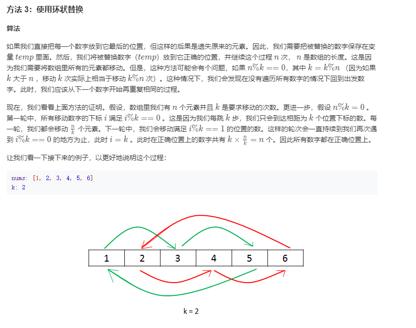

# 189-旋转数组

```c++
给定一个数组，将数组中的元素向右移动 k 个位置，其中 k 是非负数。

示例 1:

输入: [1,2,3,4,5,6,7] 和 k = 3
输出: [5,6,7,1,2,3,4]
解释:
向右旋转 1 步: [7,1,2,3,4,5,6]
向右旋转 2 步: [6,7,1,2,3,4,5]
向右旋转 3 步: [5,6,7,1,2,3,4]
示例 2:

输入: [-1,-100,3,99] 和 k = 2
输出: [3,99,-1,-100]
解释: 
向右旋转 1 步: [99,-1,-100,3]
向右旋转 2 步: [3,99,-1,-100]
说明:

尽可能想出更多的解决方案，至少有三种不同的方法可以解决这个问题。
要求使用空间复杂度为 O(1) 的 原地 算法。

来源：力扣（LeetCode）
链接：https://leetcode-cn.com/problems/rotate-array
著作权归领扣网络所有。商业转载请联系官方授权，非商业转载请注明出处。
```

---

```c++
class Solution {
public:
    void rotate(vector<int>& nums, int k) {
        k %= nums.size();
        reverse(nums.begin(), nums.end() - k);
        reverse(nums.end() - k, nums.end());
        reverse(nums.begin(), nums.end());
    }
};
```

---

旋转2次，O（n）的时间复杂度，O（1）的空间复杂度


---

除此之外，还可以使用**环状替换**,参见[这里](https://leetcode-cn.com/problems/rotate-array/solution/xuan-zhuan-shu-zu-by-leetcode/)



```java
public class Solution {
    public void rotate(int[] nums, int k) {
        k = k % nums.length;
        int count = 0;
        for (int start = 0; count < nums.length; start++) {
            int current = start;
            int prev = nums[start];
            do {
                int next = (current + k) % nums.length;
                int temp = nums[next];
                nums[next] = prev;
                prev = temp;
                current = next;
                count++;
            } while (start != current);
        }
    }
}

```
