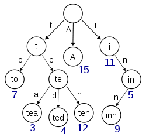

# 208. 实现 Trie (前缀树)

```c++
实现一个 Trie (前缀树)，包含 insert, search, 和 startsWith 这三个操作。

示例:

Trie trie = new Trie();

trie.insert("apple");
trie.search("apple");   // 返回 true
trie.search("app");     // 返回 false
trie.startsWith("app"); // 返回 true
trie.insert("app");   
trie.search("app");     // 返回 true
说明:

你可以假设所有的输入都是由小写字母 a-z 构成的。
保证所有输入均为非空字符串。

来源：力扣（LeetCode）
链接：https://leetcode-cn.com/problems/implement-trie-prefix-tree
著作权归领扣网络所有。商业转载请联系官方授权，非商业转载请注明出处。
```

---

## 1. 背景介绍

在计算机科学中，trie，又称前缀树或字典树，是一种有序树，用于保存关联数组，其中的键通常是字符串。与二叉查找树不同，键不是直接保存在节点中，而是由节点在树中的位置决定。一个节点的所有子孙都有相同的前缀，也就是这个节点对应的字符串，而根节点对应空字符串。一般情况下，不是所有的节点都有对应的值，只有叶子节点和部分内部节点所对应的键才有相关的值。

Trie这个术语来自于retrieval。根据词源学，trie的发明者Edward Fredkin把它读作/ˈtriː/ "tree"。[1][2]但是，其他作者把它读作/ˈtraɪ/ "try"。[1][2][3]

在图示中，键标注在节点中，值标注在节点之下。每一个完整的英文单词对应一个特定的整数。Trie可以看作是一个确定有限状态自动机，尽管边上的符号一般是隐含在分支的顺序中的。

键不需要被显式地保存在节点中。图示中标注出完整的单词，只是为了演示trie的原理。

trie中的键通常是字符串，但也可以是其它的结构。trie的算法可以很容易地修改为处理其它结构的有序序列，比如一串数字或者形状的排列。比如，bitwise trie中的键是一串比特，可以用于表示整数或者内存地址。



一个保存了8个键的trie结构，"A", "to", "tea", "ted", "ten", "i", "in", and "inn".

---

trie树常用于搜索提示。如当输入一个网址，可以自动搜索出可能的选择。当没有完全匹配的搜索结果，可以返回前缀最相似的可能。[4]trie树实际上是一个确定有限状态自动机(DFA)，通常用转移矩阵表示。行表示状态，列表示输入字符，（行，列）位置表示转移状态。这种方式的查询效率很高，但由于稀疏的现象严重，空间利用效率很低。也可以采用压缩的存储方式即链表来表示状态转移，但由于要线性查询，会造成效率低下。

来源：<https://zh.wikipedia.org/wiki/Trie>


## 实现方式

首先树一定是由一个个节点以及他们之间的链接关系来构成，题目中说明`你可以假设所有的输入都是由小写字母 a-z 构成的。`，所以我们可以定义如下节点：

```c++
class Node {
public:
	//char val;
	Node* child[26] = {NULL};
	bool end = false;  //这是不是某个元素的最终节点
	bool has_child = false;  //还有没有其他
};
```

其中Node* child[26] 表示孩子节点的位置，end表示该位置是否为一个条目的终结点。

has_child表示该节点还可不可衍生出更长的元素（本题中用不到）

### 对于插入

我们从根开始搜索它对应于第一个键字符的链接。有两种情况：

1. 链接存在。沿着链接移动到树的下一个子层。算法继续搜索下一个键字符。

2. 链接不存在。创建一个新的节点，并将它与父节点的链接相连，该链接与当前的键字符相匹配。

重复以上步骤，直到到达键的最后一个字符，然后将当前节点标记为结束节点，算法完成。

### 对于查找和前缀匹配

每个键在 trie 中表示为从根到内部节点或叶的路径。我们用第一个键字符从根开始，。检查当前节点中与键字符对应的链接。有两种情况：

1. 链接存在。我们移动到该链接后面路径中的下一个节点，并继续搜索下一个键字符。

2. 不存在链接。直接返回 false

查找到最后，检查end字段，如果为true，表示确实有这个元素，返回正，如果不为true，表示当前只是某个元素的前缀而已，返回假。（前缀匹配刚好相反（这里要看题意，看字符串本身能否作为自己的前缀））

---

```c++
class Node {
public:
	//char val;
	Node* child[26] = {NULL};
	bool end = false;  //这是不是某个元素的最终节点
	bool has_child = false;  //还有没有其他
};

class Trie {
public:
	Node* root;
	/** Initialize your data structure here. */
	Trie() {
		root = new Node();
	}

	/** Inserts a word into the trie. */
	void insert(string word) {
		auto temp = root;
		for (int i = 0; i < word.size(); i++) {
			int offset = word[i] - 'a';
			if (temp->child[offset] == NULL) {  //此时这个节点还没有创建
				temp->child[offset] = new Node();
				//temp->has_child = true;
				temp = temp->child[offset];
			}
			else {
				temp = temp->child[offset];
			}
			
		}
		temp->end = true;
	}

	/** Returns if the word is in the trie. */
	bool search(string word) {
		auto temp = root;
		for (int i = 0; i < word.size(); i++) {
			int offset = word[i] - 'a';
			if (temp->child[offset] == NULL) {  //此时这个节点还没有创建
				return false;
			}
			else {
				temp = temp->child[offset];
			}
		}
		return temp->end;
	}

	/** Returns if there is any word in the trie that starts with the given prefix. */
	bool startsWith(string prefix) {
		auto temp = root;
		for (int i = 0; i < prefix.size(); i++) {
			int offset = prefix[i] - 'a';
			if (temp->child[offset] == NULL) {  //此时这个节点还没有创建
				return false;
			}
			else {
				temp = temp->child[offset];
			}
		}
		//return temp->has_child;
		return true;
	}
};
```
