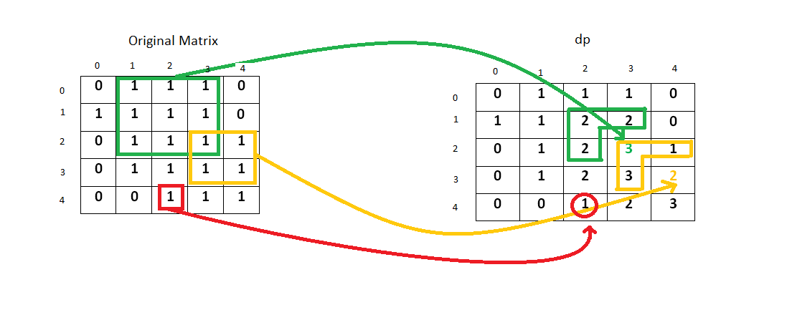

# 221. 最大正方形

```c++
在一个由 0 和 1 组成的二维矩阵内，找到只包含 1 的最大正方形，并返回其面积。

示例:

输入: 

1 0 1 0 0
1 0 1 1 1
1 1 1 1 1
1 0 0 1 0

输出: 4

来源：力扣（LeetCode）
链接：https://leetcode-cn.com/problems/maximal-square
著作权归领扣网络所有。商业转载请联系官方授权，非商业转载请注明出处。
```

---

`dp[i][j]`表示以第i行第j列为右下角所能构成的最大正方形边长

可以得到递推公式：`dp[i][j] = 1 + min(dp[i-1][j-1], dp[i-1][j], dp[i][j-1])`



(图片来源：leetcode官方)

```c++
class Solution {
public:
    int maximalSquare(vector<vector<char>>& matrix) {
        int m = matrix.size();
        if( m == 0)
            return 0;
        int n = matrix[0].size();
        int ans = 0;
        
        vector<vector<int>> dp(m+1,vector<int>(n+1,0));
        
        for(int i = 1; i <= m; i++) {
            for(int j = 1; j <= n; j++) {
                if(matrix[i-1][j-1] == '1') {
                    dp[i][j] = 1 + min(dp[i-1][j-1], min(dp[i-1][j], dp[i][j-1]));
                    ans = max(ans, dp[i][j]); 
                }
            }
        }
        
        return ans*ans;
    }
};
```

---


