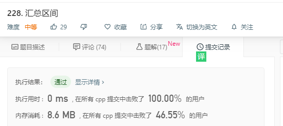

# 228. 汇总区间

```c++
给定一个无重复元素的有序整数数组，返回数组区间范围的汇总。

示例 1:

输入: [0,1,2,4,5,7]
输出: ["0->2","4->5","7"]
解释: 0,1,2 可组成一个连续的区间; 4,5 可组成一个连续的区间。
示例 2:

输入: [0,2,3,4,6,8,9]
输出: ["0","2->4","6","8->9"]
解释: 2,3,4 可组成一个连续的区间; 8,9 可组成一个连续的区间。

来源：力扣（LeetCode）
链接：https://leetcode-cn.com/problems/summary-ranges
著作权归领扣网络所有。商业转载请联系官方授权，非商业转载请注明出处。
```

---

没什么难度，属于直来直去那种题目



```c++
class Solution {
public:
	vector<string> summaryRanges(vector<int>& nums) {
		vector<string> ans;

		nums.push_back(INT_MIN + 1211);
		int len = nums.size();
		long first = 0,t = nums[0],end;

		for (int i = 1; i < len; i++) {
			if ((long)nums[i] != ++t) {
				end = i - 1;
				if (first == end) {
					ans.push_back(to_string(nums[first]));
				}
				else {
					ans.push_back(to_string(nums[first]) + "->" + to_string(nums[end]));
				}

				first = i;
				t = nums[i];
			}

		}

		return ans;
	}
};
```

---


