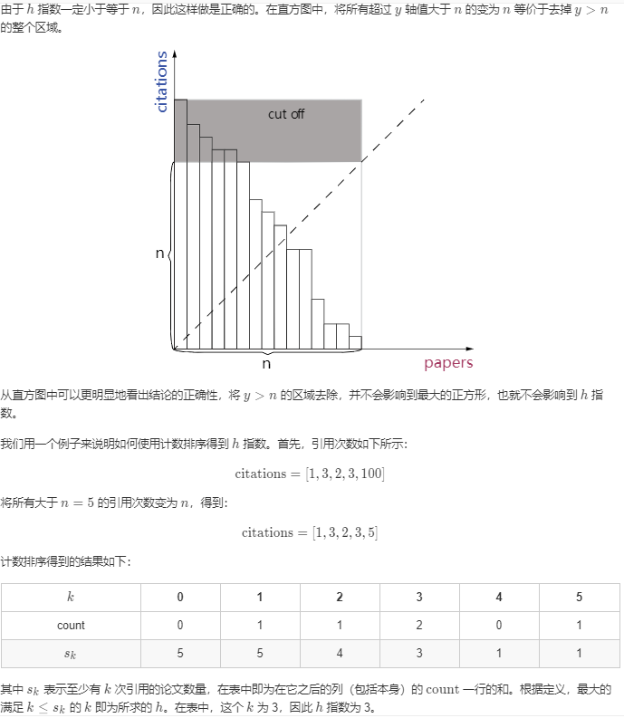

# 274. H指数

```c++
给定一位研究者论文被引用次数的数组（被引用次数是非负整数）。编写一个方法，计算出研究者的 h 指数。

h 指数的定义: “h 代表“高引用次数”（high citations），一名科研人员的 h 指数是指他（她）的 （N 篇论文中）至多有 h 篇论文分别被引用了至少 h 次。（其余的 N - h 篇论文每篇被引用次数不多于 h 次。）”

 

示例:

输入: citations = [3,0,6,1,5]
输出: 3 
解释: 给定数组表示研究者总共有 5 篇论文，每篇论文相应的被引用了 3, 0, 6, 1, 5 次。
     由于研究者有 3 篇论文每篇至少被引用了 3 次，其余两篇论文每篇被引用不多于 3 次，所以她的 h 指数是 3。
 

说明: 如果 h 有多种可能的值，h 指数是其中最大的那个。

来源：力扣（LeetCode）
链接：https://leetcode-cn.com/problems/h-index
著作权归领扣网络所有。商业转载请联系官方授权，非商业转载请注明出处。
```

---

## 解法1（排序）

思路简单

```c++
class Solution {
public:
	int hIndex(vector<int>& citations) {
		int len = citations.size();
		int ans = 0;
		sort(citations.begin(),citations.end());

		for (int i = len - 1; i >= 0; i--) {
			if ((ans + 1) <= citations[i]) {
				ans++;
			}
		}
		return ans;

	}
};
```

---

## 解法2：计数

如果一篇文章的引用次数超过论文的总数 nn，那么将它的引用次数降低为 nn 也不会改变 hh 指数的值。

所以使用计数排序，计数的个数最大不超过n。

思路来自leetcode官方解题：



```c++
class Solution {
public:
	int hIndex(vector<int>& citations) {
		int len = citations.size();
		int ans = len;
		vector<int> papers(len + 1, 0);
		for (int c : citations)
			papers[min(len, c)]++;
		
		for (int s = papers[len]; ans > s; s += papers[ans])
			ans--;
		return ans;

	}
};

```

---
