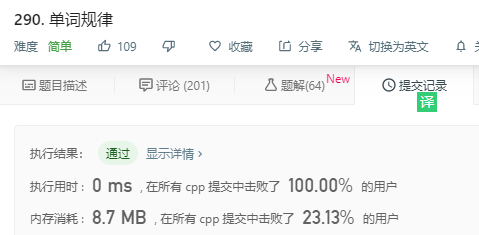

# 290. 单词规律

```c++
给定一种规律 pattern 和一个字符串 str ，判断 str 是否遵循相同的规律。

这里的 遵循 指完全匹配，例如， pattern 里的每个字母和字符串 str 中的每个非空单词之间存在着双向连接的对应规律。

示例1:

输入: pattern = "abba", str = "dog cat cat dog"
输出: true
示例 2:

输入:pattern = "abba", str = "dog cat cat fish"
输出: false
示例 3:

输入: pattern = "aaaa", str = "dog cat cat dog"
输出: false
示例 4:

输入: pattern = "abba", str = "dog dog dog dog"
输出: false
说明:
你可以假设 pattern 只包含小写字母， str 包含了由单个空格分隔的小写字母。 

来源：力扣（LeetCode）
链接：https://leetcode-cn.com/problems/word-pattern
著作权归领扣网络所有。商业转载请联系官方授权，非商业转载请注明出处。
```

---

两个数组分别记录该元素上次出现的位置，从头到尾进行比较并且更新，如果不相同则返回假。

注意位置为0表示第一次出现，位置为1表示第一个元素。



```c++
class Solution {
public:
	bool wordPattern(string pattern, string str) {
		vector<string> words;
		string s;
		for (int i = 0; i < str.size(); i++)
			if (str[i] == ' ') {
				if (s.size())
					words.push_back(s);
				s = "";
			}
			else
				s += str[i];

		if (s.size())
			words.push_back(s);


		if (pattern.size() != words.size())
			return false;

		int a[27] = { 0 };

		unordered_map<string, int> helper;
		for (int i = 0; i < pattern.size(); i++) {
			if (a[pattern[i] - 'a'] != 0) {
				if (a[pattern[i] - 'a'] != helper[words[i]])
					return false;
			}
			else {
				if (helper.count(words[i]) != 0)
					return false;
			}
			a[pattern[i] - 'a'] = i+1;
			helper[words[i]] = i + 1;
		}
		return true;
	}
};
```

---


