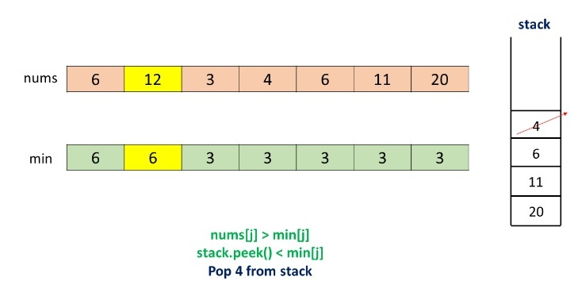

# 456-132模式

```c++
给定一个整数序列：a1, a2, ..., an，一个132模式的子序列 ai, aj, ak 被定义为：当 i < j < k 时，ai < ak < aj。设计一个算法，当给定有 n 个数字的序列时，验证这个序列中是否含有132模式的子序列。

注意：n 的值小于15000。

示例1:

输入: [1, 2, 3, 4]

输出: False

解释: 序列中不存在132模式的子序列。
示例 2:

输入: [3, 1, 4, 2]

输出: True

解释: 序列中有 1 个132模式的子序列： [1, 4, 2].
示例 3:

输入: [-1, 3, 2, 0]

输出: True

解释: 序列中有 3 个132模式的的子序列: [-1, 3, 2], [-1, 3, 0] 和 [-1, 2, 0].

来源：力扣（LeetCode）
链接：https://leetcode-cn.com/problems/132-pattern
著作权归领扣网络所有。商业转载请联系官方授权，非商业转载请注明出处。
```

---

参考的[官方题解](https://leetcode-cn.com/problems/132-pattern/solution/132mo-shi-by-leetcode-2/)



```python
class Solution:
    def find132pattern(self, nums: List[int]) -> bool:
        if len(nums) < 3:
            return False

        stack = []
        X = {}
        X[0] = nums[0]

        for i in range(1, len(nums)):
            X[i] = min(X[i - 1], nums[i])

        for j in range(len(nums) - 1, -1, -1):
            if nums[j] > X[j]:
                while stack and stack[-1] <= X[j]:
                    stack.pop()
                if stack and stack[-1] < nums[j]:
                    return True
                stack.append(nums[j])

        return False
```

---


