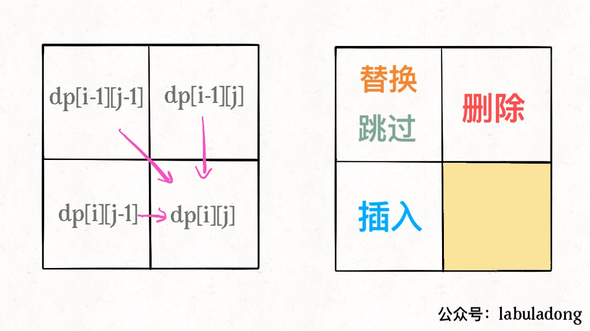

# 72. 编辑距离

```c++
给定两个单词 word1 和 word2，计算出将 word1 转换成 word2 所使用的最少操作数 。

你可以对一个单词进行如下三种操作：

插入一个字符
删除一个字符
替换一个字符
示例 1:

输入: word1 = "horse", word2 = "ros"
输出: 3
解释: 
horse -> rorse (将 'h' 替换为 'r')
rorse -> rose (删除 'r')
rose -> ros (删除 'e')
示例 2:

输入: word1 = "intention", word2 = "execution"
输出: 5
解释: 
intention -> inention (删除 't')
inention -> enention (将 'i' 替换为 'e')
enention -> exention (将 'n' 替换为 'x')
exention -> exection (将 'n' 替换为 'c')
exection -> execution (插入 'u')

来源：力扣（LeetCode）
链接：https://leetcode-cn.com/problems/edit-distance
著作权归领扣网络所有。商业转载请联系官方授权，非商业转载请注明出处。
```

---

## 解析，使用递归版好理解

参考了[labuladong](https://leetcode-cn.com/u/labuladong/) 的解题策略（[这里](https://leetcode-cn.com/problems/edit-distance/solution/bian-ji-ju-chi-mian-shi-ti-xiang-jie-by-labuladong/)）


```python
def minDistance(s1, s2) -> int:

    def dp(i, j):
        # base case
        if i == -1: return j + 1
        if j == -1: return i + 1
        
        if s1[i] == s2[j]:
            return dp(i - 1, j - 1)  # 啥都不做
            # 本来就相等，不需要任何操作
            # s1[0..i] 和 s2[0..j] 的最小编辑距离等于
            # s1[0..i-1] 和 s2[0..j-1] 的最小编辑距离
            # 也就是说 dp(i, j) 等于 dp(i-1, j-1)


        else:
            return min(
                dp(i, j - 1) + 1,    # 插入
                # 解释：
                # 直接在 s1[i] 插入一个和 s2[j] 一样的字符
                # 那么 s2[j] 就被匹配了，前移 j，继续跟 i 对比
                # 别忘了操作数加一

                dp(i - 1, j) + 1,    # 删除
                # 直接把 s[i] 这个字符删掉
                # 前移 i，继续跟 j 对比
                # 操作数加一

                dp(i - 1, j - 1) + 1 # 替换
                # 我直接把 s1[i] 替换成 s2[j]，这样它俩就匹配了
                # 同时前移 i，j 继续对比
                # 操作数加一
            )

    # i，j 初始化指向最后一个索引
    return dp(len(s1) - 1, len(s2) - 1)
```

---

递归会造成大量的重复计算，使用动态规划可以节省大量的时间。

大概原理如下：




```c++
class Solution {
public:

	int minDistance(string word1, string word2) {
		int m = word1.length();
		int n = word2.length();

		vector<vector<int>> dp(m + 1, vector<int>(n + 1));

		for (int i = 0; i <= m; ++i) {
			dp[i][0] = i;
		}
		for (int j = 0; j <= n; ++j) {
			dp[0][j] = j;
		}
		for (int i = 1; i <= m; ++i) {
			for (int j = 1; j <= n; ++j) {
				if (word1[i - 1] == word2[j - 1]) {
					dp[i][j] = dp[i - 1][j - 1];
				}
				else {
					dp[i][j] = min(dp[i - 1][j - 1], min(dp[i][j - 1], dp[i - 1][j])) + 1;
				}
			}
		}
		return dp[m][n];
	}
};
```

---


