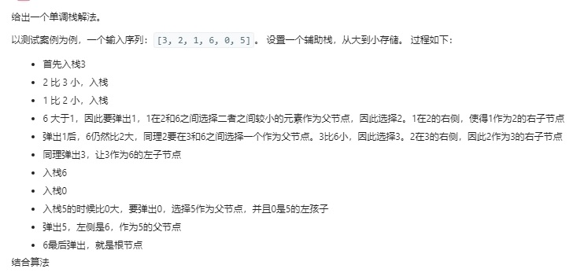

# 654. 最大二叉树

```c++
给定一个不含重复元素的整数数组。一个以此数组构建的最大二叉树定义如下：

二叉树的根是数组中的最大元素。
左子树是通过数组中最大值左边部分构造出的最大二叉树。
右子树是通过数组中最大值右边部分构造出的最大二叉树。
通过给定的数组构建最大二叉树，并且输出这个树的根节点。

 

示例 ：

输入：[3,2,1,6,0,5]
输出：返回下面这棵树的根节点：

      6
    /   \
   3     5
    \    / 
     2  0   
       \
        1
 

提示：

给定的数组的大小在 [1, 1000] 之间。

来源：力扣（LeetCode）
链接：https://leetcode-cn.com/problems/maximum-binary-tree
著作权归领扣网络所有。商业转载请联系官方授权，非商业转载请注明出处。
```

---

## 方法1：分治，左右递归

比较简单，不展开讨论

## 方法2：顺序遍历，递归构造方法

来源于[@若水轻盈](https://leetcode-cn.com/problems/maximum-binary-tree/solution/czi-xia-er-shang-by-ruo-shui-qing-ying/)的解题

遍历一次数组并随时将新的节点插入树的相应位置，如果当前遍历的值大于树的根节点，则将当前节点作为新的根节点，将原来的树当作新根节点的左子树，否则的话，将其递归的交给根节点的右子树处理（因为从左向右遍历，新的节点一定在右边）。

```c++
/**
 * Definition for a binary tree node.
 * struct TreeNode {
 *     int val;
 *     TreeNode *left;
 *     TreeNode *right;
 *     TreeNode(int x) : val(x), left(NULL), right(NULL) {}
 * };
 */
class Solution {
public:
    TreeNode* BuildTree(TreeNode* root,int next){
        if(root == NULL){
            TreeNode* node = new TreeNode(next);
            return node;
        }
        if(next > root->val){
            TreeNode* node = new TreeNode(next);
            node->left = root;
            return node;
        }else{
            root->right = BuildTree(root->right,next);
            return root;
        }
    }
    
    TreeNode* constructMaximumBinaryTree(vector<int>& nums) {
        if(nums.size() == 0) return NULL;
        TreeNode* result = NULL;
        for(int i=0;i<nums.size();i++){
            result = BuildTree(result,nums[i]);
        }
        return result;
    }
};
```

---

## 方法3，使用栈



来源于评论区@[szza](https://leetcode-cn.com/problems/maximum-binary-tree/solution/zui-da-er-cha-shu-by-leetcode/)的解题

```c++
class Solution {
public:
    TreeNode* constructMaximumBinaryTree(std::vector<int>& nums) {
        if(nums.empty()) 
            return nullptr;
            
        stack<TreeNode*> nodes;
        
        TreeNode* curNode = nullptr;

        for(int i=0; i < nums.size(); i++) { 

            while(!nodes.empty() && nodes.top()->val  <  nums[i]) { 
                TreeNode* top = nodes.top(); 
                nodes.pop();

                if(!nodes.empty() && nodes.top()->val < nums[i]) {
                    nodes.top()->right = top;
                }
                else  {
                    curNode = new TreeNode(nums[i]);
                    curNode->left = top; 
                }
            }

            // push 
            if(curNode){
                nodes.push(curNode);
                curNode = nullptr;
            }
            else {
                nodes.push(new TreeNode(nums[i]));
            }
            
        }

        while(!nodes.empty()) { 
            curNode = nodes.top(); nodes.pop();

            if(!nodes.empty()) 
                nodes.top()->right = curNode;
            
        }

        return curNode;
    }
};
```

