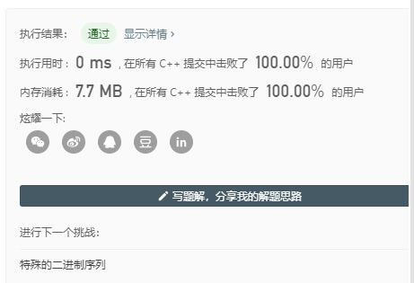

# 678. 有效的括号字符串

```c++
给定一个只包含三种字符的字符串：（ ，） 和 *，写一个函数来检验这个字符串是否为有效字符串。有效字符串具有如下规则：

任何左括号 ( 必须有相应的右括号 )。
任何右括号 ) 必须有相应的左括号 ( 。
左括号 ( 必须在对应的右括号之前 )。
* 可以被视为单个右括号 ) ，或单个左括号 ( ，或一个空字符串。
一个空字符串也被视为有效字符串。
示例 1:

输入: "()"
输出: True
示例 2:

输入: "(*)"
输出: True
示例 3:

输入: "(*))"
输出: True
注意:

字符串大小将在 [1，100] 范围内。

来源：力扣（LeetCode）
链接：https://leetcode-cn.com/problems/valid-parenthesis-string
著作权归领扣网络所有。商业转载请联系官方授权，非商业转载请注明出处。
```

---

先从左到右扫描一遍，记录`*`和`(`的个数，当`(`不够的时候用`*`来凑。这时不管`(`多出来多少。
再从右到左扫描一遍，记录`*`和`)`的个数，当`)`不够的时候用`*`来凑。如果能通过这两个遍历，就是正确答案。

为什么一定要两次遍历，只遍历一次，然后比较剩余的`*`和`(`不行吗？

答案是不行的，如果出现这种`(*)((*`，最后剩余的2个`*`和2个`(`，但是此处的`*`却不能抵消`(`，因为第一个`*`出现在左括号之前，所以必须再从后往前遍历一遍，检测是否出现不能抵消的左括号。

双100%



```c++
class Solution {
public:
    bool checkValidString(string s) {
        int n_star = 0;
        int n_left = 0;
        for (auto c : s) {
            if (c == '(') n_left++;
            else if (c == '*') n_star++;
            else {
                if (n_left > 0) n_left--;
                else {
                    if (n_star > 0) n_star--;
                    else
                        return false;
                }
            }
        }

        n_star = 0;
        int n_right = 0;
        for (int i = s.size()-1; i >= 0; i--) {
            auto c = s[i];
            if (c == ')') n_right++;
            else if (c == '*') n_star++;
            else {
                if (n_right > 0) n_right--;
                else {
                    if (n_star > 0) n_star--;
                    else
                        return false;
                }
            }
        }

        return true;
    }
};
```

---


