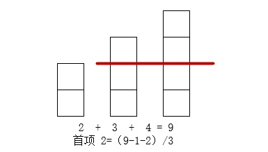

# 面试题57 - II. 和为s的连续正数序列

```c++
输入一个正整数 target ，输出所有和为 target 的连续正整数序列（至少含有两个数）。

序列内的数字由小到大排列，不同序列按照首个数字从小到大排列。

 

示例 1：

输入：target = 9
输出：[[2,3,4],[4,5]]
示例 2：

输入：target = 15
输出：[[1,2,3,4,5],[4,5,6],[7,8]]
 

限制：

1 <= target <= 10^5

来源：力扣（LeetCode）
链接：https://leetcode-cn.com/problems/he-wei-sde-lian-xu-zheng-shu-xu-lie-lcof
著作权归领扣网络所有。商业转载请联系官方授权，非商业转载请注明出处。
```

---

## 解析一 左右滑动窗口法

没有难度

## 解析二 数学计算

数学方法求解，看了 [@magic_conch](https://leetcode-cn.com/problems/he-wei-sde-lian-xu-zheng-shu-xu-lie-lcof/solution/c-0msshu-xue-jie-fa-by-magic_conch/)的解题，很有收获，就是解析写的不清楚，还有点小错误，现在我把他揉碎了讲一讲。

`start`加到`end` `=` `target`，根据等差数列求和公式`（首相+尾项）*项数/2`那么有`(start+end)*(end-start+1)/2 = target`

其实就是简单的等差数列求和，也就是将`start`加到`end`再倒着写一遍，倒序相加，两两之和为`start+end`,一共有`end-start+1`项，相乘即为`target * 2`。

为了简单起见，我们将*2去掉，直接求符合`(start+end)*(end-start+1) = target * 2`条件的`start`和`end`。

问题就变成了试着找到所有符合条件的`start`和`end`。

我们将项数`end-start+1`记为`i`，则两两之和`(start+end)`=`target*2/i`，把`(start+end)`记为`s`，也就是`s =target*2/i`。发现在项数`i`和`target`确定的情况下`start`和`end`可以通过项数`i`计算出来，计算公式为`start = (s-i+1)/2`,`end = (s+i-1)/2`

计算公式其实就是将两个等式`start+end = s`（两两和），`end-start+1 = i`（项数），移项，`start`和`end`单独放在一边，然后消掉一个参数即可。

所以我们先确定`i`,再将所有其他值通过`target`和`i`计算出来，找出满足条件的就好。

需要满足以下条件：

1. 两两之和`s = target*2/i`，为整数，也就是说`i`能被`target*2`整除
2. 通过`i`计算出的`start`和`end`也都是整数 ，根据上面的计算公式`start = (s-i+1)/2`,`end = (s+i-1)/2`，等价于`i`和`s`的奇偶性不同。
3. `start`必须是大于`0`的数

实现过程中，`i`从大到小循环，依次判断，找出满足条件的`i`，然后确定`start`和`end`，生成答案即可。

```c++
class Solution {
public:
	vector<vector<int>> findContinuousSequence(int target) {
		vector <vector<int>> ans;
		target *= 2;
		for (int i = target / 2 - 1; i >= 2; i--) {
			int s = target / i;
			//三个判断分别对应了上面的三个条件
			if (target % i == 0 && (i + s) % 2 == 1 && s - i > 0) {
				vector<int> tmp;
				int start = (s - i + 1) / 2, end = (s + i - 1) / 2;
				for (int j = start; j <= end; j++)
					tmp.push_back(j);
				ans.push_back(tmp);
			}
		}
		return ans;
	}
};
```

---

## 解析三 取巧方法

这道题其实和 [829. 连续整数求和](https://leetcode-cn.com/problems/consecutive-numbers-sum/)差不多。只不过最后求的答案格式不太一样。在829的评论区有许多有意思的解法。

现在我们来重新审视一下这道题在求什么。

如果两个连续的数之和为`target`，这两个数相差为1，也就是说将较大的那个数减一，就是两个相等的数之和为`target - 1`。这个数就是`(target - 1)/2`，只要保证能整除，就是我们需要的解。

进一步讲，如果三个连续的数和为`target`，则将中间那个数减一，最后那个数减二，就是三个相等的数之和为`target - 1 - 2`。这个数就是`(target - 1 - 2)/3`，只要保证能整除，就是我们需要的解。



所以，不断的将`target`的尖端削去，判断能否整除**项数**即可。

```c++
class Solution {
public:
    vector<vector<int>> findContinuousSequence(int target) {
        vector <vector<int>> ans;
        int n = 2; //起始的项数为2
        target -= 1; //项数为2,所以先将target第一个尖端削去
        
        while(target > 0){
            if(target % n == 0){ //满足条件，生成一个解
                vector<int> t(n);
                int start = target/n; //首项
                for(int i=0 ;i<n;i++) {
                    t[i] = start +i;
                }
                ans.push_back(t);
            }
            target -= n; //为下一轮削去尖端
            n += 1; //项数+1
        }
        
        //要求数字由小到大排列,翻转即可
        reverse(ans.begin(),ans.end());
        return ans;
    }
};
```

