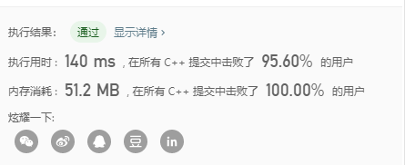

# 面试题59 - II. 队列的最大值

```c++
请定义一个队列并实现函数 max_value 得到队列里的最大值，要求函数max_value、push_back 和 pop_front 的时间复杂度都是O(1)。

若队列为空，pop_front 和 max_value 需要返回 -1

示例 1：

输入: 
["MaxQueue","push_back","push_back","max_value","pop_front","max_value"]
[[],[1],[2],[],[],[]]
输出: [null,null,null,2,1,2]
示例 2：

输入: 
["MaxQueue","pop_front","max_value"]
[[],[],[]]
输出: [null,-1,-1]
 

限制：

1 <= push_back,pop_front,max_value的总操作数 <= 10000
1 <= value <= 10^5

来源：力扣（LeetCode）
链接：https://leetcode-cn.com/problems/dui-lie-de-zui-da-zhi-lcof
著作权归领扣网络所有。商业转载请联系官方授权，非商业转载请注明出处。
```

---

没有开IED，就在网页完成，一遍过

熟能生巧诚不我欺



```c++
class MaxQueue {
public:
    queue<int> q1;
    vector<int> q2;
    MaxQueue() {

    }
    
    int max_value() {
        return q2.size() == 0 ? -1 : q2[0];
    }
    
    void push_back(int value) {
        q1.push(value);
        while(!q2.empty() && q2.back() < value)
            q2.pop_back();
        q2.push_back(value);
    }
    
    int pop_front() {
        if(q1.empty())
            return -1;
        int t = q1.front();
        q1.pop();
        if(t == q2[0])
            q2.erase(q2.begin());
        return t;
    }
};

/**
 * Your MaxQueue object will be instantiated and called as such:
 * MaxQueue* obj = new MaxQueue();
 * int param_1 = obj->max_value();
 * obj->push_back(value);
 * int param_3 = obj->pop_front();
 */
```

---


